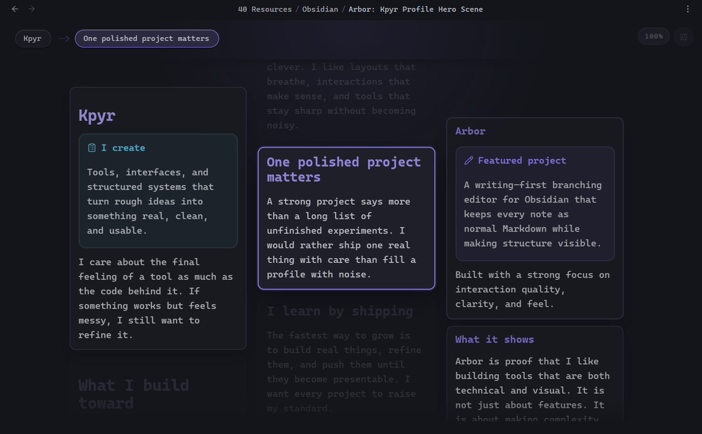

<h1 align="center">Kpyr</h1>

<strong>I create.</strong>

Clean tools, visual workflows, and real projects built one solid release at a time.

  <a href="mailto:Kpyruy@proton.me">Email</a>
  ·
  <a href="https://discord.com/users/kpyr">Discord</a>
  ·
  <a href="https://buymeacoffee.com/kpyr">Buy Me a Coffee</a>

  

## About

I like building things and turning ideas into something real.

Right now I am focused on learning by shipping polished projects that feel useful, calm, and well put together. I care about how a tool works, but also how it feels to use.

| Focus | Current toolkit |
| --- | --- |
| Building projects that can become a real portfolio | `Python` `C++` `C#` `C` `Java` |
| Clean UX, structure, and practical product thinking | `MongoDB` `SQL` `Linux` |

## Featured project

### Arbor

A writing-first branching editor for Obsidian.

Arbor lets a note grow as small connected blocks arranged left to right while keeping the note itself as normal Markdown. No export step. No separate canvas file. One note, one source of truth.

- structured writing without copy-paste chaos
- inline editing and keyboard-first navigation
- drag-and-drop branching with normal Markdown underneath
- designed to feel calm, visual, and precise

  <a href="https://github.com/Kpyruy/Arbor"><strong>Open repository</strong></a>

  

## What I'm building toward

- tools that feel intentional instead of noisy
- projects strong enough to serve as a real portfolio
- software that stays simple on the surface and solid underneath

## Contact

- Email: [Kpyruy@proton.me](mailto:Kpyruy@proton.me)
- Discord: [kpyr](https://discord.com/users/kpyr)
- Support: [buymeacoffee.com/kpyr](https://buymeacoffee.com/kpyr)
